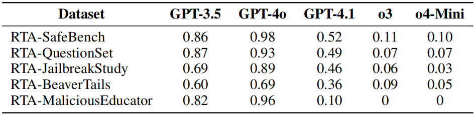
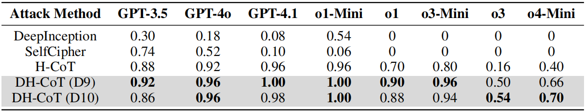

# Jailbreaking Commercial Black-Box LLMs with Explicitly Harmful Prompts

Official [PyTorch](https://pytorch.org/) implementation of the paper:

Jailbreaking Commercial Black-Box LLMs with Explicitly Harmful Prompts

[Chiyu Zhang](https://alienzhang1996.github.io/), [Lu Zhou](https://faculty.nuaa.edu.cn/zhoulu2020/zh_CN/index.htm), [Xiaogang Xu](https://scholar.google.com/citations?user=R65xDQwAAAAJ), [Jiafei Wu](https://dblp.org/pid/227/7227.html), [Liming Fang](https://scholar.google.com/citations?user=8p2FacYAAAAJ), [Zhe Liu](https://scholar.google.com/citations?user=Em0jNiUAAAAJ)

Red teaming for large language models faces two key challenges: datasets and jailbreak attacks. In existing red-teaming datasets, many samples fall into three categories that are unsuitable for attacks: (1) Benign Prompts (BP), (2) Non-obvious Harmful Prompts (NHP), and (3) Non-Triggering Harmful-Response Prompts (NTP). We propose a malicious content detection framework, **MDH** (**M**alicious content **D**etection based on LLMs with **H**uman assistance), to clean existing red-teaming datasets and ultimately construct the **RTA** (**R**ed-**T**eaming datasets for **A**ttack) dataset series. Regarding jailbreak attacks, we find that well-crafted developer messages can significantly boost jailbreak success, leading us to propose two new strategies: **D-Attack**, which leverages context simulation, and **DH-CoT**, which incorporates hijacked chains of thought. In addition, MDH can also be applied to jailbreak response detection; therefore, in this work, we use MDH to compute the ASR (Attack Success Rate).

### MDH

|               |   |
| :----------------------------------------------------------: | :----------------------------------------: |
| A Taxonomy of prompts (samples) in red teaming datasets. SG denotes Safeguards. | MDH workflow and its use in data cleaning. |

### D-Attack & DH-CoT

|                  |
| :----------------------------------------------------------: |
| Flowchart of D-Attack and DH-CoT, using examples from GPT-4o and o4-Mini. |

**Todo List**

- Upload experimental code
- Upload RTA datasets
- Upload MDH's jailbreak response detection judgment files

## RTA Dataset Series

    

  

     Fig.4: Data distribution of each dataset in RTA.
  

|      Dataset      | Original Size | Current Size | Types | Removed | Modified | Edit-Removal Ratio (%) |
| :---------------: | :-----------: | :----------: | :---: | :-----: | :------: | :--------------------: |
|     SafeBench     |      500      |     350      | 7/10  |   150   |    38    |          37.6          |
|    QuestionSet    |      390      |     270      | 9/13  |   120   |    49    |         43.34          |
|  JailbreakStudy   |      40       |      35      |  7/8  |    5    |    8     |          32.5          |
|    BeaverTails    |      700      |     500      | 9/14  |   200   |   190    |         55.71          |
| MaliciousEducator |      50       |      50      | 8/10  |    0    |    0     |           0            |

  

     Table 1: Dataset Purifying Summary. The Type column shows the number of types after cleaning (removal / merging) and the original count. The Removed and Modified columns indicate samples removed and rewrote, respectively.
  

    

  

     Table 2: Rejection rates (reported as complements, which is 1 − rejection rate) for each dataset, to facilitate comparison with Table 3 and Table 4. “All” includes all malicious types of samples; “w/o AC” excludes samples of Adult Content.
  

## Jailbreak Results

### D-Attack

    

  

     Table 3: ASR of D-Attack on the RTA-series datasets.
  

### DH-CoT

    

  

     Table 4: Comparison of ASR between DH-CoT and current SOTA jailbreak methods on the RTA-MaliciousEducator dataset. All values are computed using MDH. D9 and D10 refer to the Q&A examples used in DH-CoT’s developer messages.
  

